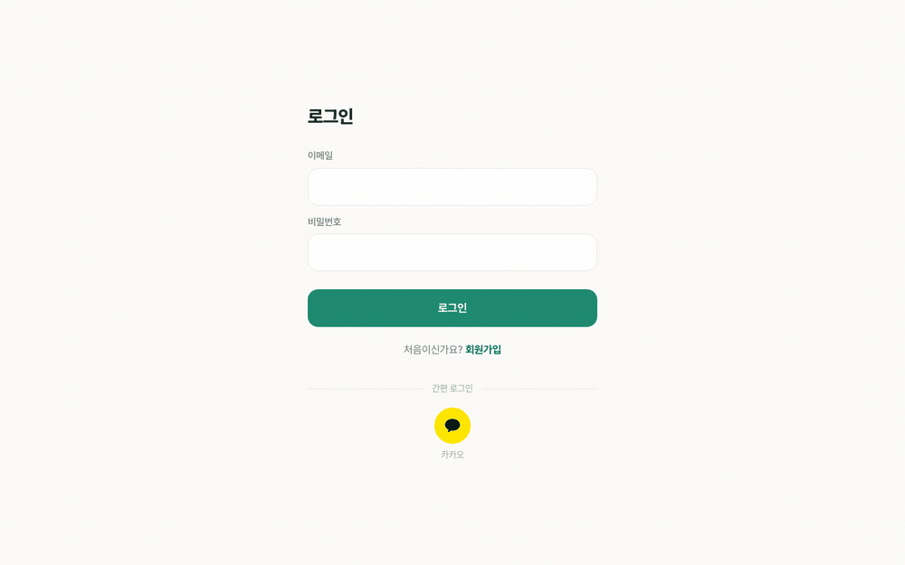

# 터전 — estate-web (FE)

건물주와 입주자를 잇는 커뮤니케이션 플랫폼 **터전**의 프론트엔드입니다.
백엔드 [estate-server](https://github.com/Jin-dev92/estate-server-kafka)(NestJS · Prisma · Kafka)의
**git 서브모듈**(`web/`)로 관리됩니다.

## 화면

<p align="center">
  
</p>

로그인 → 입주자 대시보드 → 게시판 → 게시글 → 1:1 채팅 → 알림 → 설정 → 건물주 대시보드 → 건물 관리 → 호실 관리 순서로 전환됩니다.
Playwright로 프로덕션 빌드를 목 백엔드에 붙여 찍었습니다(`docs/guides/screenshots.md`).

## 스택

- **Next.js 16** (App Router) · **React 19** · **TypeScript**
- **Tailwind CSS v4** — 디자인 토큰을 CSS 변수로 두고 `@theme`로 매핑
- **TanStack Query v5** · **React Hook Form** · **Zod**
- **Socket.IO** — 채팅·알림 실시간 이벤트
- **Vitest** · **Playwright** — 단위/컴포넌트 테스트와 핵심 사용자 흐름 E2E
- **Pretendard** (가변 폰트, 한국어)

## 주요 기능

- 건물주·입주자 역할별 가입과 httpOnly 세션 인증
- 역할별 대시보드와 건물·호실·초대코드 관리
- 게시글·댓글 작성과 게시글 좋아요 낙관적 토글
- Socket.IO 기반 1:1 채팅과 실시간 알림
- 프로필·비밀번호 변경과 로그아웃

## 디자인 시스템

메인 브랜드 컬러는 **딥 틸그린 `#1F8A70`** (집·안심·신뢰). 레퍼런스 톤은 토스(명료)·당근(온기)·Airbnb(사진/카드 위계).
모든 토큰(컬러·타이포·공간·모션)은 `app/globals.css`의 `:root` CSS 변수가 단일 출처이며 Tailwind 유틸로 매핑됩니다.

- 디자인 시스템 스펙: estate-server `docs/superpowers/specs/2026-06-22-design-system-design.md`
- 온보딩 설계 스펙: estate-server `docs/superpowers/specs/2026-06-22-onboarding-design.md`

## 마일스톤

화면을 영역별로 끊어 순차 구현합니다. 백엔드 도메인(estate-server)과 1:1로 대응합니다.

| 단계 | 화면 / 기능 | 상태 |
|---|---|---|
| **FE-M0** | 온보딩 — 로그인 · 역할 선택 · 건물주 가입 · 입주자 초대 통합 가입 · httpOnly 세션 | ✅ 구현 |
| **FE-M1** | 대시보드 홈 (OWNER / TENANT) | ✅ 구현 |
| **FE-M2** | 건물 · 호실 · 초대코드 관리 (OWNER) | ✅ 구현 |
| **FE-M3** | 게시판 (목록 · 상세 · 작성 · 댓글 · 좋아요 낙관적 토글) | ✅ 구현 |
| **FE-M4** | 1:1 채팅 (WebSocket 실시간) | ✅ 구현 |
| **FE-M5** | 알림 센터 (실시간 · 단건/전체 읽음 · 딥링크) | ✅ 구현 |
| **FE-M6** | 설정 · 프로필 (이름 수정 · 비밀번호 변경 · 로그아웃) | ✅ 구현 |

> 후속(F): OAuth 소셜 로그인, 채팅 자동 번역 — 백엔드 F1 · F2에 맞춰 추가.

## E2E 테스트 (Playwright)

목 BE(HTTP, `BACKEND_URL`) + 목 socket.io WS 서버 기반 결정론적 E2E. 인증은 `loginAs`/`loginAsOwner` prefill 픽스처(세션 쿠키 주입, 토큰으로 OWNER/TENANT 역할 분기)로 시작하고, 셀렉터는 시멘틱만, flaky는 burn-in으로 차단한다. `pnpm e2e`가 목 BE·목 WS·Next(프로덕션 빌드)를 자동 기동해 **chromium·firefox·webkit 3개 엔진**에서 전 스위트를 실행한다. 게시판은 상태있는 목으로 작성→반영(영속성)까지 검증하고, 목 응답은 `lib/api` 타입에 묶여(**drift 게이트**) 계약 변경을 `typecheck`로 잡는다. 상세 규약은 `AGENTS.md`의 E2E 섹션 참고.

> CI 참고: 제약된 러너에서 webkit이 첫 네비게이션/reload에 간헐적 콜드스타트 지연을 겪어 일부 영속성 테스트가 1차 시도에서 stall할 수 있다. `retries: 2`(CI)로 흡수하므로 잡은 GREEN이며, 로그의 복구된 `✘`는 하드 실패가 아니다. 빈도는 `workers` 축소·타임아웃 상향으로 낮췄다(`playwright.config.ts`).

| 커버리지 | 상태 |
|---|---|
| 로그인 스모크 (성공→대시보드 / 실패→에러) | ✅ |
| 카카오 OAuth 로그인 (콜백 진입 · 기존계정→대시보드 · 신규가입→역할선택→대시보드 · state 불일치 에러 · BE 에러) | ✅ |
| 온보딩 가입 (건물주 가입→대시보드 · 입주자 초대코드 미리보기→가입→입주 · 무효 코드 에러) | ✅ |
| 대시보드 홈 (TENANT '내 계약' · OWNER '내 건물'+보유 건물, 역할별 렌더) | ✅ |
| 인증 가드 미들웨어 (미인증→보호 라우트 차단→`/login` · 인증 시 로그인/가입 페이지→대시보드 차단) | ✅ |
| 설정 (프로필 렌더 · 이름 수정→재조회 반영 영속성 · 비밀번호 변경 성공/현재 비밀번호 불일치 · 로그아웃) | ✅ |
| 건물·호실 (OWNER: 건물 목록→상세 호실 · 초대코드 발급→코드 노출) | ✅ |
| 게시판 (목록 · 상세 · 글/댓글 작성→목록·상세 반영 영속성, 상태있는 목) | ✅ |
| 알림 센터 (목록 렌더 · 단건 읽음+딥링크 · 전체 읽음→리로드 후 미읽음 배지 소거 영속성) | ✅ |
| 채팅 (방 목록→진입 · start-chat 방생성 · 1:1 실시간 연결·전송→에코 · 비참가자 에러 · 재연결 · connect_error · 멀티유저 수신, 목 socket.io) | ✅ |
| 폼 클라 검증 (가입 비번 8자 미만 · 초대코드 빈값 · 비번폼 현재비번 필수, 네트워크 전 차단) | ✅ |
| 멀티브라우저 (chromium · firefox · webkit 3개 엔진에서 전 스위트 실행) | ✅ |
| 목 BE 타입 drift 게이트 (`tsc --noEmit`로 `lib/api` 계약 변경 검출) | ✅ |

### 후속 백로그 (남은 작업)

> 완료된 항목(알림·온보딩·초대코드·채팅·설정·대시보드·게시판/프로필/알림 영속성·폼검증·멀티브라우저·`MESSAGES.auth.login`·카카오 로그인 E2E·채팅 재연결/connect_error/멀티유저 E2E)은 위 커버리지 표에 반영. 아래는 **남은 작업**만. 우선순위 순으로 정렬(2026-07-02 지정).

- [x] **[완료] Playwright 공식 에이전트 시험 평가**: Generator·Healer 시범 모두 완료 → **조건부 유지**로 결론(`docs/test/playwright-agents-review.md` 9절). 두 시범 모두 규약 준수율 100%·사람 수정 0건이었고, 특히 Healer는 `test.fixme()`로 도망가지 않고 원인을 고쳤다. 다만 Healer의 차별 가치(실 DOM 라이브 디버깅)가 MCP 서버 불안정으로 실증되지 않아 **기본 도구로 확대하지 않고 선택적으로** 쓴다. 운영 규칙 5개는 검토 문서 9절, 요약은 `AGENTS.md` E2E 절.
- [x] **[완료] 드리프트 게이트 확장**: leases·buildings는 이미 `mockLease(): Lease`·`mockBuilding(): Building`으로 편입돼 있었고, 전수 조사에서 드러난 실제 빈틈은 **auth 도메인이 통째로 게이트 밖**이었다(`send()`의 `body: unknown` 때문에 인라인 응답은 타입 검사가 걸리지 않음). 로그인·갱신·로그아웃·카카오 2경로를 `TokenPair`·`KakaoLoginResult`에 묶은 빌더로 옮기고, `unreadCount` 이중 정의도 함수 반환 타입 역산으로 정리했다. 뮤테이션으로 게이트 작동 실증(`TokenPair`에 필드 추가 → 편입 후 2건 검출 / 편입 전 0건).
- [ ] 테스트 typecheck 정비: `tsconfig.vitest.json` 분리 + `vi.fn()` 파라미터 타입화(약 44건) + `**/*.test.*` exclude 제거 — 현재 루트 tsconfig의 `types:["vitest/globals"]` 스톱갭 해소.

> 백엔드(estate-server) 후속: `prisma-account` repo의 `provider` 런타임 검증(현재 KAKAO만이라 저위험) — estate-server 백로그로 관리.

## 시작하기

### 요구사항

- Node.js 20.9 이상 (Next.js 16 요구사항)
- pnpm 9.15.0 (`packageManager` 필드로 고정)
- 로컬 통합 개발 시 `http://localhost:3001`에서 실행 중인 `estate-server`

Corepack으로 저장소에 고정된 pnpm 버전을 활성화합니다.

```bash
corepack enable
pnpm install
```

### 환경변수

프로젝트 루트에 `.env.local`을 만듭니다. 아래 값은 모두 선택 사항이며, 미설정 시 백엔드와 WebSocket은 `http://localhost:3001`을 사용합니다.

```dotenv
# 서버 컴포넌트와 Route Handler에서만 사용하는 백엔드 주소
BACKEND_URL=http://localhost:3001

# 브라우저에서 사용하는 Socket.IO 서버 주소
NEXT_PUBLIC_WS_URL=http://localhost:3001

# 카카오 OAuth JavaScript 앱 키
NEXT_PUBLIC_KAKAO_CLIENT_ID=
```

> `NEXT_PUBLIC_*` 변수는 브라우저 번들에 공개됩니다. 비밀 키나 서버 자격 증명은 이 접두사에 넣지 말고, 서버 전용 환경변수와 백엔드에서 관리하세요.

### 실행 및 검증

| 명령 | 설명 |
|---|---|
| `pnpm dev` | `http://localhost:3000`에서 개발 서버 실행 |
| `pnpm build` | 프로덕션 빌드 생성 |
| `pnpm start` | 프로덕션 서버 실행 |
| `pnpm lint` | ESLint 검사 |
| `pnpm test` | Vitest 단위·컴포넌트 테스트 |
| `pnpm typecheck` | TypeScript 타입 검사 |
| `pnpm e2e` | 목 BE·WS와 프로덕션 빌드를 사용한 Playwright E2E |
| `pnpm e2e:ui` | Playwright UI 모드 실행 |
| `pnpm e2e:burn` | 전 E2E를 5회 반복해 flaky 여부 확인 |

```bash
pnpm dev
```

## 애플리케이션 구성

페이지 조회는 Server Component가 백엔드를 직접 호출합니다. 브라우저에서 발생하는 쓰기 요청은 같은 출처의 Next.js Route Handler(`/api/*`)를 거쳐 `estate-server`로 전달되며, 세션 토큰은 httpOnly 쿠키로 관리합니다. 채팅과 알림만 `NEXT_PUBLIC_WS_URL`의 Socket.IO 서버에 연결합니다.

```text
브라우저
  ├─ 페이지 요청 ──> Next.js Server Component ──> estate-server
  ├─ 쓰기 요청 ───> Next.js Route Handler ─────> estate-server
  └─ 실시간 연결 ─> Socket.IO ─────────────────> estate-server
```

## 서브모듈로 클론하기

이 레포는 estate-server의 `web/` 서브모듈입니다. 부모 레포와 함께 받으려면:

```bash
git clone --recurse-submodules https://github.com/Jin-dev92/estate-server-kafka.git
# 이미 클론했다면
git submodule update --init --recursive
```

> 개발은 부모 레포의 `web/`(이 서브모듈) 안에서 진행합니다.

## 구조

```text
app/
  (app)/              # 인증 후 화면(대시보드·게시판·채팅·알림·설정)
  api/                # 브라우저 요청을 백엔드로 전달하는 Route Handler
  auth/               # 카카오 OAuth 콜백
  login/              # 로그인
  signup/             # 역할별 회원가입
  globals.css         # 디자인 토큰과 Tailwind @theme 매핑
components/
  auth/               # 인증·역할 선택 폼
  board/              # 게시판 폼·목록·댓글·좋아요
  building/           # 건물·호실·초대코드
  chat/               # 채팅 시작·대화
  dashboard/          # 역할별 대시보드
  notifications/      # 알림 목록·실시간 provider
  settings/           # 프로필·비밀번호·로그아웃
  ui/                 # 공통 UI 컴포넌트
lib/
  api/                # 도메인별 백엔드 API 클라이언트
  chat/               # WebSocket과 채팅 표시 로직
  notifications/      # 알림 딥링크
  query/              # TanStack Query key·mutation
  constants.ts        # 경로·역할·스토리지 키 단일 출처
  messages.ts         # 사용자 노출 문구 단일 출처
  schemas.ts          # Zod 폼 검증 스키마
e2e/
  fixtures/           # 인증·목 데이터 픽스처
  mock-be/            # E2E용 HTTP 백엔드
  mock-ws/            # E2E용 Socket.IO 서버
  tests/              # Playwright 핵심 사용자 흐름
docs/                 # 설계·계획·테스트 문서
test/                 # Vitest 공통 테스트 유틸
```
